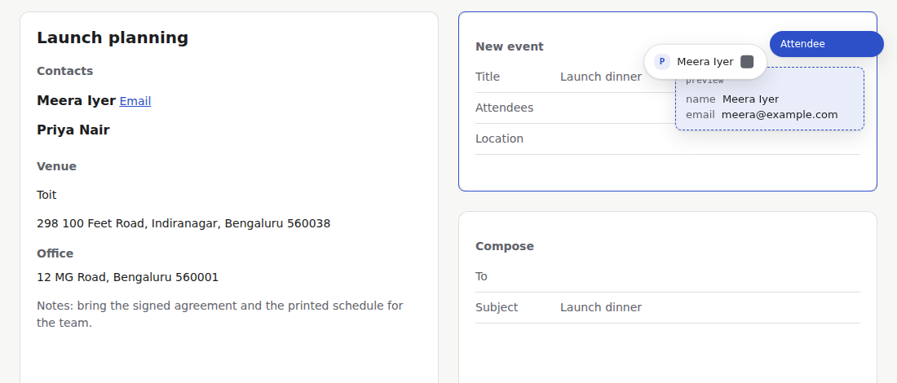
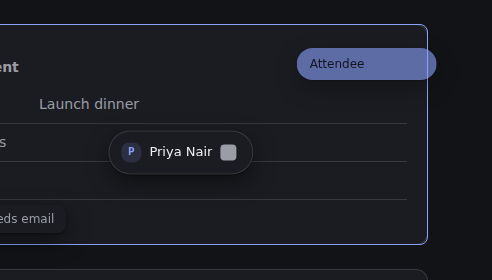

# 08. Layer 2a report (interaction engine, tested in Chromium)

## Verdict
The platform-independent half of Layer 2 is built and works in a real browser: point at a thing, lift it, carry it, see where it can go, preview, place, undo. **Nothing Windows-specific is verified** (global key, click-through overlay, UI Automation, elevated windows), and **the 10-person usability gate is not done**. Those need your machine and real people. See `docs/09-windows-spike-kit.md`.

## What was built
- `packages/interaction`: GRAB, APPROACH, PREVIEW, PLACE as a pure reducer `(state, event) -> {state, effects}`. Time and hit-testing are injected, so the same machine drives a browser, Electron or a test.
- `packages/extract-web/src/element.ts`: the element classifier (option A). Pointing at text returns every plausible reading (Person, Location, Event, Product) and the destination picks the one it accepts.
- `packages/overlay`: React 19 + Tailwind v4 + `motion/react`, mounted in a shadow root so page CSS cannot restyle it.
- `apps/harness`: a page with a contact list, a venue and three destinations (calendar, mail, tasks) backed by real capability contracts and the reference bridge.
- `apps/spike-win`: a kit for you to run on Windows (not run here).

## Rules the engine enforces (all tested)
- Esc cancels from every state and changes nothing. Once a placement has started, Esc is ignored so the Undo toast is never lost.
- High risk (send) needs a real hold of at least 600 ms. A 300 ms hold places nothing.
- Medium risk (every guessed reading) asks for one light confirmation. Low risk places on release, with Undo.
- Confidence under 0.5 is not offered unless you hold Shift; its chip is disabled and says why ("Can't: needs email").
- The source object is never changed. Undo restores the destination.
- Keyboard only path: Ctrl+Shift+L lifts, Tab walks destinations, Enter places.

## Measured (Chromium, headless, this sandbox)
| Thing | Budget | Result |
|---|---|---|
| Chip reached to ghost painted | under 150 ms | p50 7.4 ms, p95 11.5 ms |
| Release to toast painted (in-page bridge) | under 1 s | p50 8.1 ms, p95 10.3 ms |
| Main-thread stalls while carrying and while the toast shows | none over 100 ms | worst gap 25 to 45 ms |
| axe-core, every state, light and dark | no serious or critical | clean |

The placement number is the in-page reference bridge only. A real Google or Notion call will be slower and is not measured.

## Element classifier, measured against hand-labelled targets
Dev split (25 targets, 3181 random elements), then held-out (15 targets, 1891 random elements). The held-out numbers come from a run **after** fixes made on dev, so they are not clean.

| | Dev | Held-out (after fixes) |
|---|---|---|
| Person name, target found | 92% (11/12) | 100% (5/5) |
| Person, right offer | 83% of all | 100% |
| Location name, found | 100% (10/10) | 89% (8/9) |
| Location name, right offer | 60% | 78% |
| Address, right offer | 100% (3/3) | 100% (1/1) |
| Ordinary text offered at confidence 0.5 or more | 1% (16/3181) | 1% (12/1891) |

About 61% of ordinary elements get some reading, but all of those are below 0.5, so they are only reachable with Shift. Small samples: read these as "no systematic failure seen", not "solved".

## Bugs found by using it, and fixed
- **Serious:** a contact with no email was offered with the neighbouring contact's email. Readings now stop at an ancestor holding more than 200 characters of text. Regression tests added.
- A whole pane containing an address was read as an address. The address rule is stricter (postal code ends the text, at most one sentence, no URLs or identifiers).
- Tailwind v4 `@property` is ignored inside shadow roots, so translate, border and shadow silently became `none`. The build now re-declares the defaults on `:host`, and a test guards it.
- Per-frame re-render after placement starved the main thread (1.7 s stalls). Fixed with adaptive ticks and a static CSS countdown.
- Confirm chip text was cut off; chips are wider and labels capitalised.
- The mockup wrongly offered "Location" for a Person; corrected.

## Screenshots
Light and dark, each state, in `docs/images/layer2/`: lift, approach, preview, confirm, placed, blocked.  
**Missing:** a mid-hold screenshot. Capturing takes longer than the 600 ms hold, so the hold completed before the image. The hold behaviour is covered by the test (300 ms places nothing, 800 ms places), not by a picture.

## Not done, stated plainly
- Any Windows code. The spike kit exists but has never run.
- Bridges for Google Calendar, Gmail, Sheets, a task manager and Notion (contracts and request builders). Live calls need your credentials, so none are made.
- The 10-person usability test.
- Places that publish no name the classifier can read (images, maps) are still unreachable.
